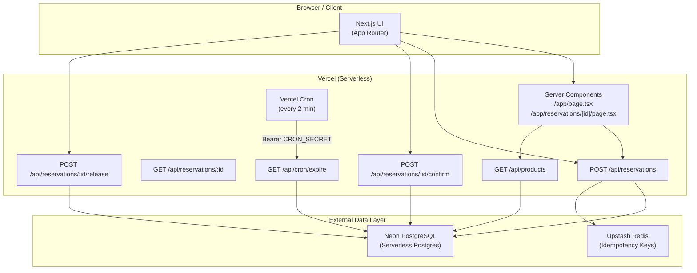
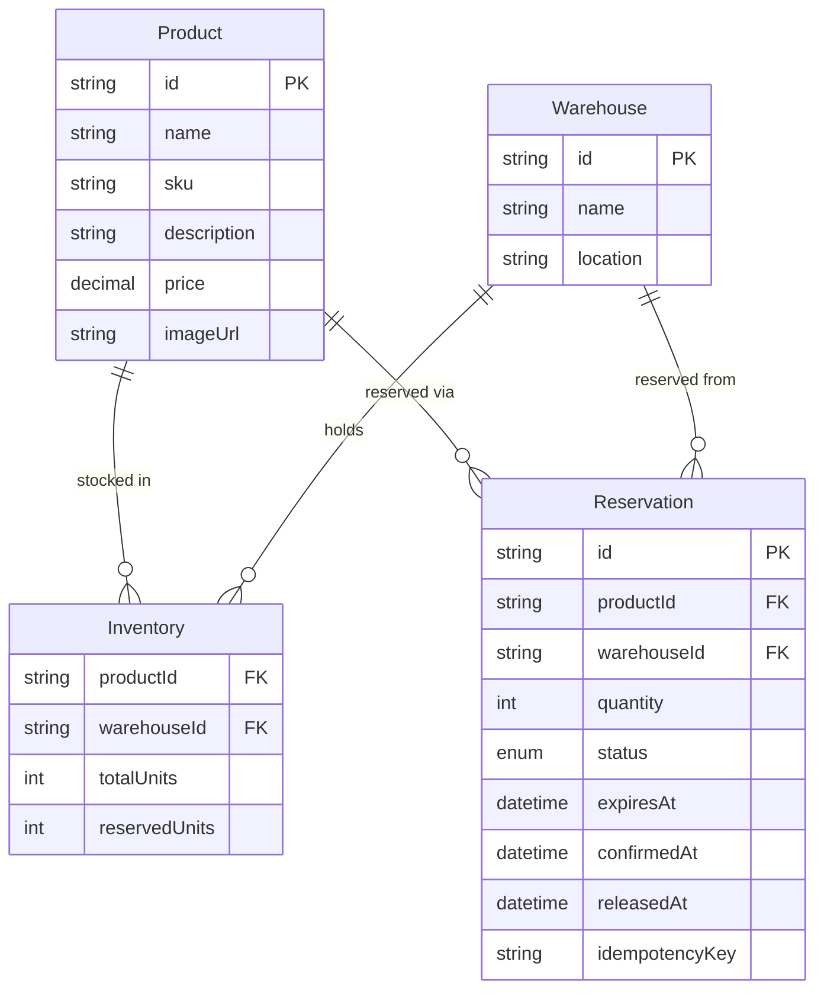
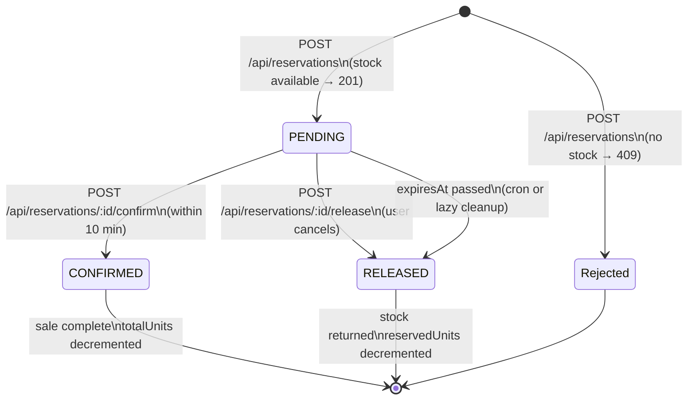
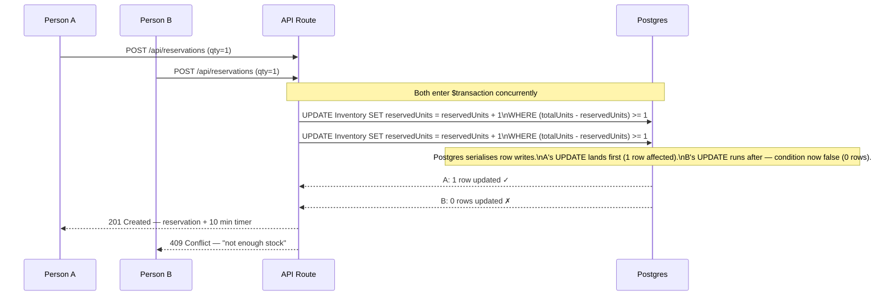
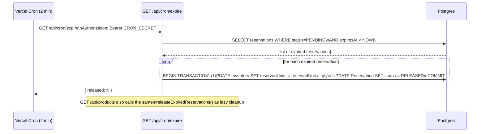

# Architecture

## System Overview

---

## Database Schema

---

## Reservation Lifecycle

---

## Race Condition — Sequence Diagram

Two users hitting the last unit simultaneously:

---

## Expiry & Stock Recovery Flow

---

## Key Design Decisions

| Decision | Choice | Why |
|---|---|---|
| Concurrency safety | Postgres conditional UPDATE (no locks) | Row-level write serialization is sufficient for single primary DB; no deadlocks, no Redis locks |
| Expiry mechanism | Vercel Cron + lazy cleanup on reads | Serverless has no persistent processes; cron gives ≤2 min staleness at zero cost |
| Idempotency | Upstash Redis (24h TTL) | Prevents double-reserve/double-charge on network retries |
| ORM | Prisma 7 with `@prisma/adapter-pg` | Driver adapter pattern needed for Neon's serverless Postgres |
| Confirm semantics | Decrements both `reservedUnits` AND `totalUnits` | Confirm = permanent sale; release = stock returned (only `reservedUnits` decremented) |
